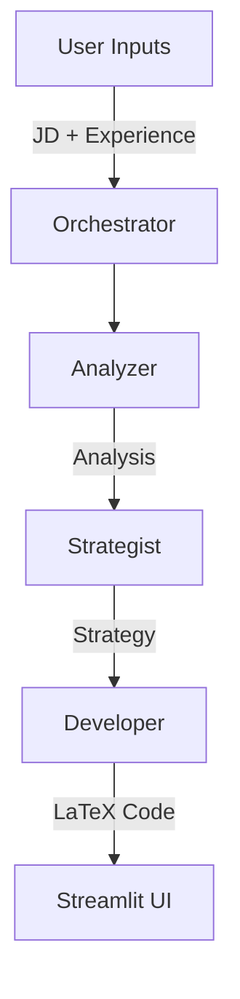

# System Architecture & Specification

## Overview
The **Dynamic Resume Creator** is a multi-agent system designed to tailor resumes for specific job descriptions. It uses a pipeline of specialized AI agents to ensure high-quality, targeted results.

## Agent Pipeline
The system follows a linear 3-stage pipeline managed by the `ResumeOrchestrator`:

### 1. Job Analyzer Agent (`core.agents.analyzer`)
*   **Input**: Raw Job Description text.
*   **Responsibility**: Extracts key keywords, required skills, and "hidden" cultural values from the JD.
*   **Output**: Structured analysis summary.

### 2. Strategy Agent (`core.agents.strategist`)
*   **Input**: Job Analysis + User's Raw Experience.
*   **Responsibility**: Decides *which* experience to highlight and *how* to phrase bullet points to match the analysis.
*   **Output**: A list of strategic bullet point modifications.

### 3. Developer Agent (`core.agents.developer`)
*   **Input**: Strategy + Original LaTeX Template.
*   **Responsibility**: Writes valid LaTeX code. It creates the final PDF-ready markup, ensuring it compiles without errors.
*   **Output**: Final `.tex` string.

## Data Flow

## Technical Stack
*   **Frontend**: Streamlit
*   **LLM Interface**: `BaseLLMProvider` (Abstract Base Class)
*   **Implementations**: OpenAI, Anthropic, Gemini, Groq, Ollama.
