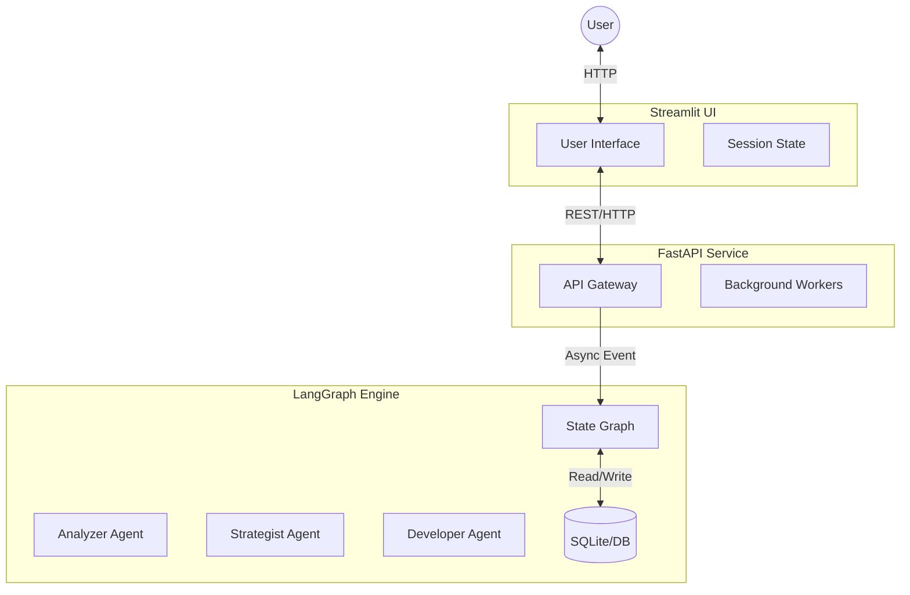

# Dynamic Resume Creator - System Architecture

## Overview
The Dynamic Resume Creator is a service-oriented application that uses an agentic workflow to analyze job descriptions and generate tailored LaTeX resumes.

## High-Level Architecture

The system consists of three distinct layers:



## 1. Frontend Layer (Streamlit)
- **Responsibility**: Presentation and Input Collection only.
- **Components**:
    - Input Forms (Job Description, Resume Upload).
    - Status Polling (Checks API for progress).
    - Result Rendering (PDF viewing / LaTeX code editing).
- **Communication**: Sends JSON payloads to the FastAPI backend; does not import `core` logic directly.

## 2. API Layer (FastAPI)
- **Responsibility**: Validation, Request Management, and Model Configuration.
- **Endpoints**:
    - `POST /generate`: Initiates a new resume generation job.
    - `GET /status/{job_id}`: Retrieves the current state of the LangGraph execution.
    - `GET /result/{job_id}`: Returns the final artifacts.
- **Validation**: Uses Pydantic models to ensure Job Descriptions and Resume content are valid strings before processing.

## 3. Core Layer (LangGraph)
- **Responsibility**: Business Logic and Orchestration.
- **Framework**: LangGraph + LangChain.
- **State Management**:
    - `ResumeState`: A TypedDict containing the shared memory for the current execution.
    - `Checkpointer`: Persists state to SQLite to allow recovery and history.

### The Agentic Flow (StateGraph)

1.  **Analyzer Node**:
    - Input: `job_description`
    - Output: `job_analysis` (Key requirements, keywords, culture).
2.  **Strategist Node**:
    - Input: `job_analysis`, `raw_experience`
    - Output: `strategy_plan` (The angle/narrative to take).
3.  **Developer Node**:
    - Input: `strategy_plan`, `sample_latex`
    - Output: `latex_code`.
4.  **Compiler Node (Tool)**:
    - Input: `latex_code`
    - Output: `is_valid` + `compilation_log`.
    - **Logic**: If errors exist -> Loop back to Developer with error context.

## Data Structures

### ResumeState
```python
class ResumeState(TypedDict):
    # Inputs
    job_description: str
    raw_experience: str
    sample_latex: str

    # Artifacts
    analysis: str
    strategy: str
    draft_latex: str

    # Control Flow
    compilation_errors: List[str]
    revision_count: int
    is_complete: bool
```

## Technology Stack
- **Orchestration**: LangGraph
- **LLM Interface**: LangChain (Standardized ChatModels)
- **Server**: FastAPI + Uvicorn
- **Frontend**: Streamlit
- **Validation**: Pydantic
